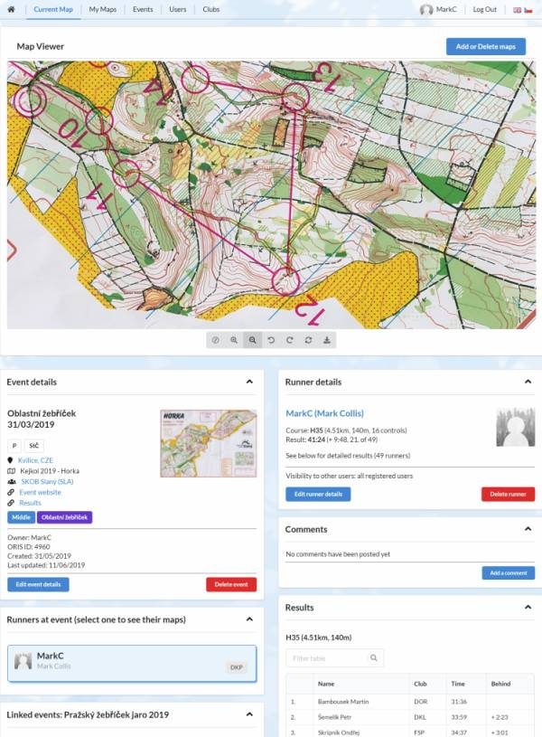

# MapOholic (client)

MapOholic is an online database designed to make it easy to keep track of collections of orienteering maps, together with associated routes, results, and other related information.

This repository contains the code for the front end of the application, built with [React](https://reactjs.org) and [Redux](https://redux.js.org). The code for the back end can be found in the related repository [markcollis/mapoholic-server](https://github.com/markcollis/mapoholic-server).

This README has two main sections: *About MapOholic* explains what it does and why, then *Using MapOholic* provides practical information about for anyone that wants to try it out for themselves.



# About MapOholic

## Introduction - What and Why?

Firstly, it is important to understand what MapOholic is for. It is a web application to store and manage collections of orienteering maps and associated information about each race or training activity. As well as providing an individual orienteer with a detailed and searchable archive (a significant improvement on a shelf of ring binders!), it should make it easy for users to publish and share information with others if they wish to.

It is, of course, not a new idea. Any orienteers reading this will no doubt be aware of the existence of [DOMA](https://www.matstroeng.se/doma) (Digital Orienteering Map Archive), which has the same fundamental purpose and is widely used. I have experimented with DOMA but it has a number of limitations, including:
* As it is tightly integrated with [QuickRoute](https://www.matstroeng.se/quickroute) (not surprisingly, as it has the same author) only maps with GPS tracks added using QuickRoute are geocoded.
* The Google Maps API is no longer free to use unless you are willing to put up with 'for development purposes only' watermarks everywhere.
* Every map is a separate entity, so the maps from two-part courses or multi-day events can not be logically associated with each other.
* There are no logical connections between maps from the same event for different users.

Although DOMA is open source, it has a relatively old codebase (no major changes since 2011) and is written in PHP which I have not developed actively in for many years. Hence I decided to write my own application from scratch, using JavaScript both client-side and server-side. It is focused on my own personal requirements for a map database and is definitely *not* intended to be a clone of DOMA (e.g. I am not interested in RSS, KML export or 3D Rerun integration).

It serves two purposes: firstly as a demonstration project to showcase my capability as a JavaScript developer, and secondly as an application that I will use actively to track my own orienteering activity and encourage other club-mates to use. The rest of this section describes how I determined the user requirements for MapOholic and developed a solution from these.

## User Types

Different types of users will interact with MapOholic in different ways. Any given individual person may of course be more than one type. When developing the initial requirements, I identified three user roles, plus the 'anonymous' user who is not logged in.

1. *Anonymous* This user represents the face of the application to someone that is not logged in, whether that is a first-time visitor or a regular user that happens to be logged out.

2. *Guest* This is the most basic level of access to the application. Guest user accounts can be used to view maps that have been restricted to logged-in users, but can not edit anything or post comments. Guest users enable all of the members of a club to have read-only access to a collection of maps without requiring them to register individually.

3. *Standard* Most users will be enthusiastic orienteers that want to keep a record of their races and map-based training. They will want to be able to save scanned maps either with or without routes quickly and efficiently, but also have the flexibility to add further details. Comprehensive searching of a user's own archive is essential. Some users will also have an interested in searching for, viewing and commenting on other users' maps - either other competitors at the same event, or friends that are members of the same club or training group.

4. *Admin* This user can see everything, edit everything, and should be able to control the way in which a particular instance of the application is used from the browser interface. Initial installation, upgrades and back-end configuration are out of scope - the Admin *user* should not require the level of technical knowledge needed for this.

## User Stories

The following user stories describe the key features that I wanted MapOholic to have before starting to use it for real. They were used to guide design and development of each aspect of the application.

*Anonymous user*
1. As an anonymous visitor, I want to be presented with a clear summary of the application so that I can understand what it is and whether I am interested in investigating further.
2. As an anonymous visitor, I want to be able to browse those maps that have been saved without restrictions.
3. As an anonymous visitor, I want to be able to sign up for an account so that I can use the application myself.
4. As an existing user that is not currently logged in, I want to be able to log in so that I access my map collection. *Access should be password protected, with passwords not being stored in plain text.*

*Guest user*
1. As a guest user, I want to be able to search for and maps that have been published either to all registered users or to members of the same club(s) as the guest account.
2. As a guest user, I want to be able to view the maps and associated details that I have access to.

*Standard user*
  * Events
    1. As a standard user, I want to be able to search for events by name, date, location, etc. so that I can find a specific event of interest.
    2. As a standard user, I want to be able to browse events either in a list or on a map so that I can decide which ones may be of interest to me.
    3. As a standard user, I want to be able to view event details so that I can either confirm that it is the one I was looking for or find out more about it.
    4. As a standard user, I want to be able to add an event to the database so that I (and other users) can register attendance and upload maps from that event.
    5. As a standard user, I want to be able to edit event details to supplement or correct what is already there.
    6. As a standard user, I want to be able to delete an event that I have added in error or no longer wish to upload maps for. *This should only be possible if no other users are affected.*
    7. As a standard user, I want to be able to create and manage links between events so that it is easy to navigate between events that are related to each other.
    8. As a standard user, I want to be able to record that I ran at an event with accompanying details (course, results, etc.) so that I have access to this information later.
    9. As a standard user, I want to be able to view details for all runners at an event so that I can identify who attended and whether they have uploaded maps.
    10. As a standard user, I want to be able to edit the details of my run at an event so that I can add or amend information.
    11. As a standard user, I want to be able to add maps (including my routes) so that they can be viewed later.
    12. As a standard user, I want to be able to delete or replace my maps so that mistaken actions can be corrected.
    13. As a standard user, I want to be able to comment on both my own and others' maps so that I can interact with other users.
    14. As a standard user, I want to be able to limit access to my maps and associated details either to myself, to members of the same club(s), or to signed in users, so that I have control over who can see my data.
    15. As a standard user, I want to be able to exploit the [ORIS API](https://oris.orientacnisporty.cz/API) to quickly import relevant details for Czech events registered in that system so that I don't have to re-enter data already available online.

  * Users
    1. As a standard user, I want to be able to search for a specific user by name or browse the user list so that I can find other users of interest to me.
    2. As a standard user, I want to be able to view user details so that I can find out more about them.
    3. As a standard user, I want to be able to edit and delete my own user profile so that I can control what others know about me.
    4. As a standard user, I want to be able to limit access to my user profile either to myself, to members of the same club(s), or to signed in users, so that I have control over who can see my data.

  * Clubs
    1. As a standard user, I want to be able to search for a specific club by name or browse a list of clubs so that I can find clubs that are of interest to me.
    2. As a standard user, I want to be able to view club details (including members of the club and events organised by them) so that I can find out more about them.
    3. As a standard user, I want to be able to add a club to the database so that I can identify myself as a member or identify events organised by that club.
    4. As a standard user, I want to be able to edit club details so that I can add or amend information.
    5. As a standard user, I want to be able to delete a club that I have added in error. *This should only be possible if no other users are affected.*

  * Other
    1. As a standard user, I want to be able to view basic instructions for use of the application so that I can use it effectively.
    2. As a standard user, I want to be able to see a summary of recent activity so that I can identify recent changes of interest and remind myself of what I was recently doing.
    3. As a standard user, I want to remain logged in if the browser restarts so that I don't have to re-enter a password unneccesarily.
    4. As a standard user, I want to be able to log off and clear all locally stored data when I no longer want to use the application.

*Admin user*
1. As an administrative user, I want to be able to access, edit and delete data across the application so that I can identify and resolve any issues that may arise (performance, data quality, forgotten passwords, etc.).
2. As an administrative user, I want to be able to view all users' activity in detail so that I can identify an resolve any issues that may arise.

(Note that the type of data stored in MapOholic is not particularly personal or confidential, so it does not seem unreasonable for an administrator to have wide-ranging access.)

## Constraints
  I set myself the following constraints:
  * The application must be written in JavaScript.
  * The application must use React and Redux on the front end, and Node and Express on the back end.
  * There must be a clearly defined API between the front and back end so that in theory other people could produce clients that work with the same archive.
  * The application must work in all modern browsers.
  * The application must be responsive, noting that some aspects of functionality may not be appropriate on mobile platforms. Scanning maps and importing GPX tracks would normally be done on a PC, noting that QuickRoute is further restricted to Windows only.
  * All aspects of the user interface must be available in both English and Czech languages, with the ability to switch between the languages quickly and without losing information. (I am a native English speaker living in the Czech Republic - adding further languages to the interface should be possible, but I have no need for them nor the ability to translate into anything else.)

## Sitemap

The sitemap I created based on these requirements is as follows, at the level of pages shown to the user. Of course, these are then broken down into many smaller components.

*(if not logged in)*
* Home View (welcome and introduction)
* Events View (search/browse events and view details)
  - as a list
  - on a map
* Map View (view map and runner details) [show when runner is selected]
* Sign up (form)
* Log in (form)
* Language selector

*(if logged in)*
* Home View (welcome, introduction, recent activity)
* My Maps View (search/browse only the events that I have attended and view details)
  - as a list
  - on a map
* Events View (search/browse events, view details, add/edit/delete events)
  - as a list
  - on a map
* Map View (view map and runner details, edit/comment on maps) [show when runner is selected]
* Users View (search/browse users and view details)
* Clubs View (search/browse clubs, view details, add/edit/delete clubs)
* User Profile (view/edit/delete own user details)
* Log out
* Language selector

## Future developments

The following ideas are being considered for potential future enhancements (not in priority order).
* *Further ORIS integration*. For non-Czech readers, [ORIS](https://oris.orientacnisporty.cz) is a comprehensive portal for Czech events, entries, results, etc. Calls to the [ORIS API](https://oris.orientacnisporty.cz/API) can be used to support data entry and provide extra information for Czech-based users. Some functions already exploit ORIS, other possibilities include automatically creating each day of a multi-day event, or refreshing ORIS-derived data after initial import.
* *Additional information sources*. Even where there is not a public API, it may be possible to import event information, results, etc. from other sites if it is in a consistent format (e.g. BOF fixtures list, results produced by event software).
* *QuickRoute web services interface*. QuickRoute can export to DOMA directly from within the application. It may be possible to recreate this interface so that the same action would work with MapOholic.
* *Multi-part maps*. At the moment, multi-part maps can not be re-ordered after creation, nor can results be associated with a specific 'part'. This flexibility may be useful occasionally.
* *User groups*. Users that regularly run the same courses (whether at events or in training sessions) could benefit from the ability to compare routes and share comments more easily than switching between individual views.
* *Route drawing*. For maps where no GPS trace is available to be processed using QuickRoute, the initial workflow requires the route to be drawn manually using other image editing software. However, it would be nice to be able to upload a scanned blank map and draw the course overlay manually within the application.
* *Real-time notifications*. At present all data is pulled from the server by the client, so there is no way of letting a user know if a different user has changed something that they are viewing or editing. Due to the nature of the information being stored, this is not felt to be a major issue for now.
* *Additional QR data*. QuickRoute embeds a significant amount of route data in map images. Only the key location and boundary information is used at present, but the route data is accessible to be exploited in future.

# Using MapOholic

If you just want to *use* MapOholic as is, you can visit my own site at [mapoholic.markcollis.dev](https://mapoholic.markcollis.dev) and sign up for an account. For now, this is open to everyone although I reserve the right to limit user numbers if the server becomes overloaded.

If you want to customise the front end to explore alternative ways to exploit the same data, you just need to download and install the front end from this repository, and away you go. It is built on [Create React App](https://create-react-app.dev) so you can follow the develop, build and deploy instructions from there.

If you want to host your own instance, whether locally or publicly, you will need to download and install the [back end](https://github.com/markcollis/mapoholic-server) first, then build a version of the front end linking to the appropriate API.

## Release History

Not yet formally released (1.0.0 expected late September 2019).

<!-- |Version|Document                                             |Date     |Purpose               |
|-------|-----------------------------------------------------|--------:|----------------------|
|1.0.0  |[Release Notes](release_notes/RELEASE_NOTES_1_0_0.md)|xx/9/2019|Initial public release| -->


## Installation

```bash
git clone https//github.com/markcollis/mapoholic-client.git
cd mapoholic-client
yarn install
```
## Usage

```bash
yarn start
```
will run MapOholic locally in development mode.

```bash
yarn build
yarn global add serve [if required]
serve -s build
```
will build a production version and host it locally.

If you change any strings that need translation, ```yarn extract``` will generate an updated ```src/locales/cs/messages.po``` file in which to add new translations, then ```yarn compile``` will build the new translations in.

By default the front end will connect to the MapOholic API hosted at ```mapoholic-api.markcollis.dev```. If you have set up your own database and API, you will need to set ```MAPOHOLIC_SERVER``` in ```src/config/index.js``` accordingly.

## Packages used

The following packages have been used as key components of MapOholic. Many thanks to all their authors and contributors.
* Framework: [React](https://reactjs.org)
* State management: [Redux](https://redux.js.org)
* Routing: [React Router](https://reacttraining.com/react-router)
* Forms: [Formik](https://jaredpalmer.com/formik)
* Maps: [Leaflet](https://leafletjs.com)
* Translation: [LinguiJS](https://lingui.js.org)
* API calls: [axios](https://github.com/axios/axios)

## Contributing

Pull requests for minor amendments or bug fixes are welcome. If you are thinking of making more substantial changes, please open an issue first to discuss (or create your own fork and do whatever you like!).

## License
[ISC](https://choosealicense.com/licenses/isc/)
